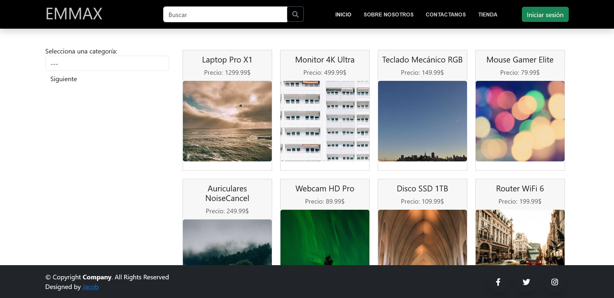
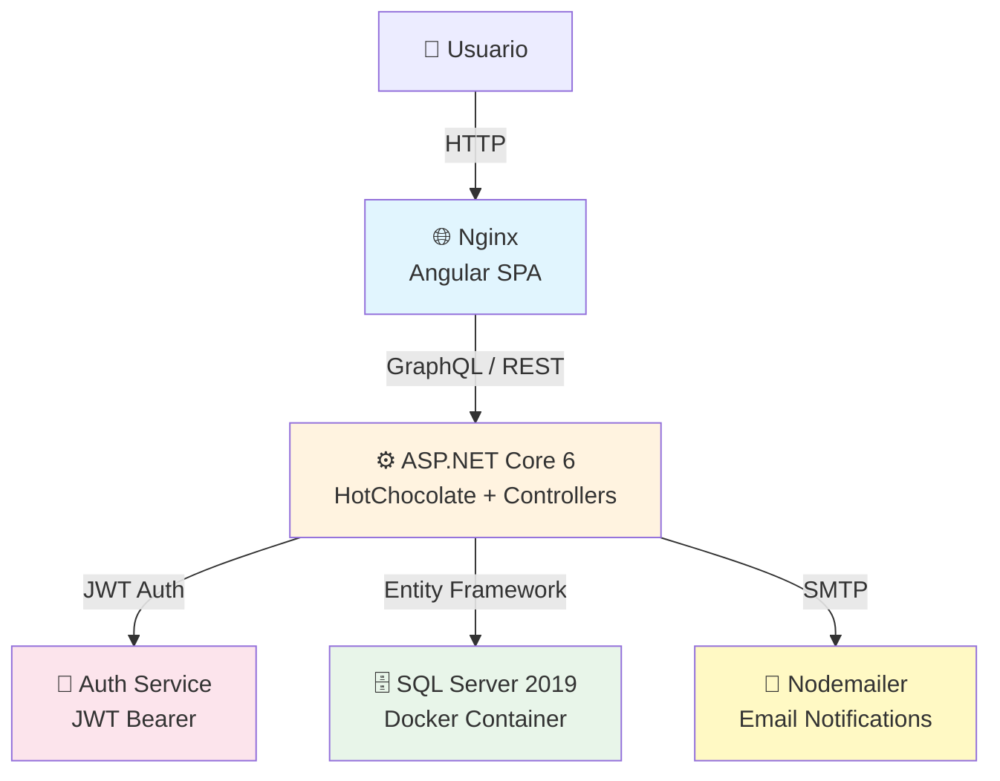

<div align="center">
  
  <h1 align="center">EMMAX Shop</h1>
  <p align="center">
    Plataforma e-commerce full-stack para la compra y venta de productos de la marca EMMAX
    <br />
    <a href="https://dev.azure.com/11075350752/Shop%20EMMAX"><strong>Azure DevOps »</strong></a>
    ·
    <a href="https://github.com/RayfelO/EMMAX-Angular-.Net-SQLServer/issues">Reportar Bug</a>
    ·
    <a href="https://github.com/RayfelO/EMMAX-Angular-.Net-SQLServer/issues">Solicitar Feature</a>
  </p>
</div>

<div align="center">

  [![Contributors][contributors-shield]][contributors-url]
  [![Forks][forks-shield]][forks-url]
  [![Stargazers][stars-shield]][stars-url]
  [![MIT License][license-shield]][license-url]
  [![Status][status-shield]][status-url]
  
  <br/>
  
  [![.NET][dotnet-shield]][dotnet-url]
  [![Angular][angular-shield]][angular-url]
  [![SQL Server][sql-shield]][sql-url]
  [![GraphQL][graphql-shield]][graphql-url]
  [![Docker][docker-shield]][docker-url]

</div>

---

> **Nota:** Este es un proyecto académico universitario. **No está pensado para producción ni recibe mantenimiento activo.** El código se conserva como registro histórico del desarrollo.

---

## 📋 Tabla de Contenidos

- [💡 Concepto](#-concepto)
- [📸 Screenshots](#-screenshots)
- [✨ Características](#-características)
- [🏗️ Arquitectura](#️-arquitectura)
- [🚀 Instalación Rápida](#-instalación-rápida)
- [📦 Instalación Detallada](#-instalación-detallada)
- [🏛️ Estructura del Repositorio](#️-estructura-del-repositorio)
- [🛤️ Roadmap](#️-roadmap)
- [🤝 Contribuir](#-contribuir)
- [📄 Licencia](#-licencia)
- [👥 Colaboradores](#-colaboradores)
- [📚 Recursos](#-recursos)

---

## 💡 Concepto

> **EMMAX Shop** es una plataforma e-commerce diseñada para ofrecer una experiencia de compra moderna y fluida. Permite a los usuarios explorar productos, gestionar su carrito, realizar pedidos y a los vendedores administrar su inventario y consultar estadísticas de ventas.

Construido como proyecto académico con stack empresarial (.NET + Angular + SQL Server), demuestra patrones de arquitectura limpia, autenticación JWT, GraphQL y despliegue containerizado.

---

## 📸 Screenshots

| Inicio — Carousel & Categorías | Catálogo de Productos |
|:---:|:---:|
|  |  |

---

## ✨ Características

| Funcionalidad | Descripción |
|--------------|-------------|
| 🏪 **Catálogo de Productos** | Exploración visual con filtros, búsqueda y detalle de productos |
| 🛒 **Carrito de Compras** | Agregar, eliminar y gestionar productos antes de pagar |
| 📊 **Dashboard de Vendedor** | Gestión de inventario, altas, bajas y modificaciones |
| 📜 **Historial de Compras** | Seguimiento de pedidos para usuarios registrados |
| 📈 **Reportes de Ventas** | Estadísticas básicas para vendedores |
| 🔐 **Autenticación JWT** | Registro e inicio de sesión seguro |
| 📧 **Notificaciones** | Integración con nodemailer para correos |

---

## 🏗️ Arquitectura



### Stack Tecnológico

| Capa | Tecnología |
|------|------------|
| **Frontend** | Angular 16, Bootstrap 5, NgBootstrap, Apollo GraphQL |
| **Backend** | ASP.NET Core 6, HotChocolate (GraphQL) + REST Controllers, Entity Framework Core 7, AutoMapper, JWT Auth, log4net |
| **Base de Datos** | SQL Server 2019 (migraciones EF Core) |
| **DevOps** | Docker Compose, GitHub Actions (CI/CD) |

---

## 🚀 Instalación Rápida

> [!NOTE]
> Requiere [Docker](https://docs.docker.com/get-docker/) y [Docker Compose](https://docs.docker.com/compose/)

```bash
git clone https://github.com/RayfelO/EMMAX-Angular-.Net-SQLServer.git
cd EMMAX-Angular-.Net-SQLServer
cp .env.example .env
docker-compose -f docker-compose.dev.yml up --build
```

- Backend: `http://localhost:5230`
- Frontend: `http://localhost:4200`

---

## 📦 Instalación Detallada

### Requisitos Previos

- [.NET 6 SDK](https://dotnet.microsoft.com/download/dotnet/6.0)
- [Node.js 16+](https://nodejs.org/)
- [Docker & Docker Compose](https://docs.docker.com/get-docker/)
- [Angular CLI](https://angular.io/cli) (`npm install -g @angular/cli`)

### 1. Clonar el repositorio

```bash
git clone https://github.com/RayfelO/EMMAX-Angular-.Net-SQLServer.git
cd EMMAX-Angular-.Net-SQLServer
```

### 2. Configurar variables de entorno

```bash
cp .env.example .env
# Edita .env con tus valores preferidos
```

### 3. Docker Compose (Recomendado)

<details>
<summary><b>Desarrollo</b></summary>

```bash
docker-compose -f docker-compose.dev.yml up --build
```
</details>

<details>
<summary><b>Producción</b></summary>

```bash
docker-compose -f docker-compose.prod.yml up --build
```
</details>

### 4. Instalación Manual (Alternativa)

<details>
<summary><b>Backend (.NET)</b></summary>

```bash
cd Backend/Core/ProyectoCore
dotnet restore
dotnet ef database update  # Requiere connection string configurada
dotnet run
```
</details>

<details>
<summary><b>Frontend (Angular)</b></summary>

```bash
cd FrontEnd/App
npm install
ng serve
```
</details>

---

## 🏛️ Estructura del Repositorio

```
EMMAX-Angular-.Net-SQLServer/
├── .github/
│   └── workflows/               # GitHub Actions CI/CD
├── Backend/
│   └── Core/
│       └── ProyectoCore/        # ASP.NET Core API + GraphQL
├── FrontEnd/
│   └── App/                     # Angular SPA
├── docker-compose.dev.yml       # Orquestación desarrollo
├── docker-compose.prod.yml      # Orquestación producción
├── .env.example                 # Variables de entorno de ejemplo
├── LICENSE                      # Licencia MIT
├── CONTRIBUTING.md              # Guía de contribución
└── README.md                    # Este archivo
```

---

## 🛤️ Roadmap

- [x] Catálogo de productos y carrito de compras
- [x] Autenticación y autorización con JWT
- [x] Dashboard administrativo de vendedor
- [x] CI/CD con GitHub Actions
- [x] Dockerización del proyecto

---

## 🤝 Contribuir

Las contribuciones son bienvenidas. Lee nuestra [guía de contribución](CONTRIBUTING.md) y consulta el [código de conducta](CODE_OF_CONDUCT.md).

1. Fork el proyecto
2. Crea tu rama (`git checkout -b feature/amazing-feature`)
3. Commit tus cambios (`git commit -m 'feat: add amazing feature'`)
4. Push a la rama (`git push origin feature/amazing-feature`)
5. Abre un Pull Request

---

## 📄 Licencia

Distribuido bajo la Licencia MIT. Consulta [`LICENSE`](LICENSE) para más información.

---

## 👥 Colaboradores

[](https://github.com/RayfelO/EMMAX-Angular-.Net-SQLServer/graphs/contributors)

Este proyecto fue desarrollado como proyecto académico por **Sebastian Fernandez**, **Rayfel Ogando**, **Avis Zucco** y **Guillermo Jorge**.

---

## 📚 Recursos

- [Azure DevOps](https://dev.azure.com/11075350752/Shop%20EMMAX)
- [Paleta de Colores](https://coolors.co/1c1c1c-daddd8-ecebe4-eef0f2-fafaff)
- [Diagrama de Base de Datos](https://lucid.app/lucidchart/3fe31cdd-185e-4da5-ab9d-0c14b0fc9c76/edit?invitationId=inv_78a2c82a-2d1c-4b54-99c2-69e78d98a50a&page=0_0#)
- [Prototipo Figma (MVP)](https://www.figma.com/design/KVdGX7aFwsas5lhmKeLQbe/EMAAX?node-id=0-1&t=356lNmXUJR812ZtG-1) — Diseño preliminar del producto mínimo viable. No representa la versión final.

<!-- MARKDOWN LINKS & IMAGES -->
<!-- https://www.markdownguide.org/basic-syntax/#reference-style-links -->
[contributors-shield]: https://img.shields.io/github/contributors/RayfelO/EMMAX-Angular-.Net-SQLServer.svg?style=for-the-badge
[contributors-url]: https://github.com/RayfelO/EMMAX-Angular-.Net-SQLServer/graphs/contributors
[forks-shield]: https://img.shields.io/github/forks/RayfelO/EMMAX-Angular-.Net-SQLServer.svg?style=for-the-badge
[forks-url]: https://github.com/RayfelO/EMMAX-Angular-.Net-SQLServer/network/members
[stars-shield]: https://img.shields.io/github/stars/RayfelO/EMMAX-Angular-.Net-SQLServer.svg?style=for-the-badge
[stars-url]: https://github.com/RayfelO/EMMAX-Angular-.Net-SQLServer/stargazers
[license-shield]: https://img.shields.io/badge/License-MIT-green.svg?style=for-the-badge
[license-url]: https://github.com/RayfelO/EMMAX-Angular-.Net-SQLServer/blob/main/LICENSE
[dotnet-shield]: https://img.shields.io/badge/.NET-6.0-512BD4?style=for-the-badge&logo=dotnet&logoColor=white
[dotnet-url]: https://dotnet.microsoft.com/
[angular-shield]: https://img.shields.io/badge/Angular-16-DD0031?style=for-the-badge&logo=angular&logoColor=white
[angular-url]: https://angular.io/
[sql-shield]: https://img.shields.io/badge/SQL%20Server-2019-CC2927?style=for-the-badge&logo=microsoft-sql-server&logoColor=white
[sql-url]: https://www.microsoft.com/en-us/sql-server
[graphql-shield]: https://img.shields.io/badge/Hot%20Chocolate-GraphQL-F25A2A?style=for-the-badge
[graphql-url]: https://chillicream.com/
[docker-shield]: https://img.shields.io/badge/Docker-2496ED?style=for-the-badge&logo=docker&logoColor=white
[docker-url]: https://www.docker.com/
[status-shield]: https://img.shields.io/badge/Status-Archived-lightgrey?style=for-the-badge
[status-url]: https://github.com/RayfelO/EMMAX-Angular-.Net-SQLServer
